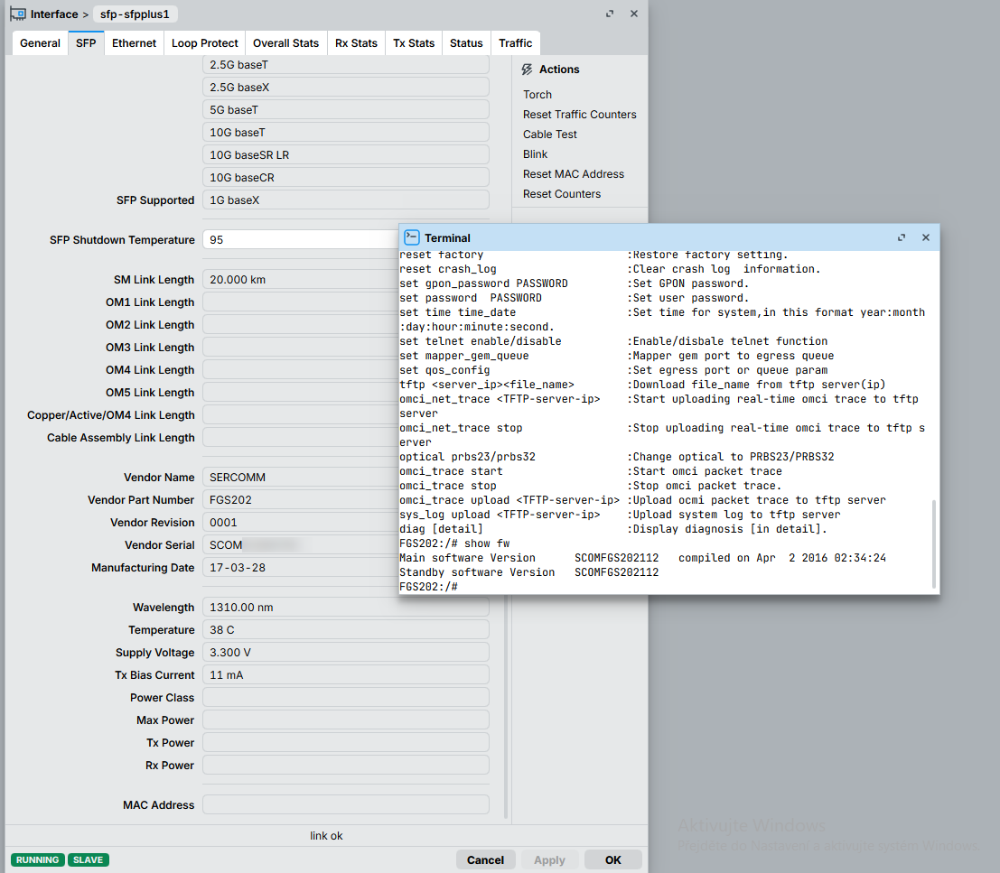

# Tested in a Mikrotik RB5009



## v0 - ENV method
set ft_flag=1 Factory info, does same as bellow, will survive config resets

but you need to desolder the flash, fw can be loeaded with tftp or OMCI ( if your OLT works ) but you can't edit envs.


## v1 - SCOMFGS202112-telnet-v1.bin
Simple patch to remove LAN check, you still need telnet and mgmt interface to be UP
```
# Hex patch, start at offset 0x0005140c
+0xC	3C 04 10 12 ->	3C 04 10 18
+0x10	24 84 08 9C ->	24 84 8D 74
+0x18	0C 00 76 FE ->	00 00 00 00
+0x20	00 40 20 21 ->	00 00 00 00

# Decompiled Pseudocode:
Original:
        sub_1002BBEC(*(_BYTE **)(a1 + 4), v62, 0x308u);
        v22[1] = v20;
        v23 = sub_1001DBF8("ft_flag", 1);
        if ( sub_1002FA54(v23, "1") )
        {

Patched:
        sub_1002BBEC(*(_BYTE **)(a1 + 4), v61, 0x308u);
        v22[1] = v20;
        if ( sub_1002FA54("1", "1") )
        {
```

## v2 - SCOMFGS202112-telnet-v2.bin
Starts the network on boot, combined with the v1 check
Unless OMCI disables the network again it should boot up and be accesible

```
# Hex patch, start at offset 0x100526B0
+08-11  00 00 00 00
+14	00 40 20 21 ->	24 A5 8D 74
+1C	24 A5 8D 74 ->	00 A0 20 21

# Decompiled Pseudocode:
Original:
    v34 = sub_1001DBF8("ft_flag", 1);
    if ( !sub_1002FA54(v34, "1") )
    {
      if ( sub_1004EF94(*(_BYTE *)(v3 + 12)) )
      {
        sub_10108140("Network initialization failed!\n");
        sub_1002250C("Network initialization failed!\n");
        goto LABEL_66;
      }
      MEMORY[0x9F214DE8] = 1;
      MEMORY[0x9F214DE4] = 1;
      MEMORY[0x9F214DE0] = 3;
    }

Patched:
    if ( !sub_1002FA54("1", "1") )
    {
      if ( sub_1004EF94(*(_BYTE *)(v3 + 12)) )
      {
        sub_10108140("Network initialization failed!\n");
        sub_1002250C("Network initialization failed!\n");
        goto LABEL_66;
      }
      MEMORY[0x9F214DE8] = 1;
      MEMORY[0x9F214DE4] = 1;
      MEMORY[0x9F214DE0] = 3;
    }

```

This patch acts as if factory flag was set...